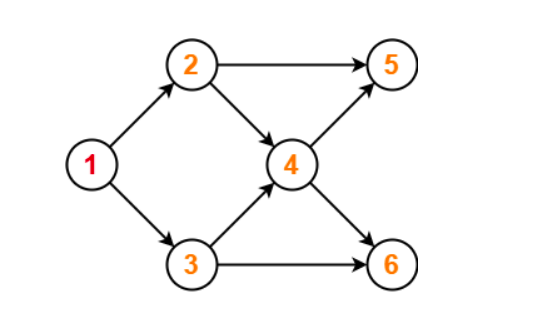

# Topological Sorting

**Topological Sorting** for a Directed Acyclic Graph (_DAG_) is a linear ordering of vertices, such that for every edge from vertex _u_ to _v_, _u_ comes before _v_. It is a graph traversal in which every vertex _a_ is visited only after all its dependencies are visited. For example,  topological sorting may be used to represent an order of tasks to be performed, if every vertex represents a task and the edges represent a constraint that one task must be performed before another. 

## Using DFS:

DFS is somewhat modified to get a topological ordering of the vertices. This algorithm is started from a vertex and then the method is recursively called for all its adjacent vertices. A temporary stack is used. For a vertex, after all its adjacent vertices, only then, it is pushed in the stack. Later, the stack is emptied by popping the vertices one by one, which is, ultimately, the topological sorting of the DAG. Consider an edge $uv$ directed from $u$ to $v$. If the vertex $v$ occurs before $u$ in the topological ordering, the graph is not an DAG.

Below is a implementation of the same in `topoSortUsingDFS.cpp`. It uses the `class Graph` as a graph from `graph.hpp` mentioned before.

```cpp
// topoSortUsingDFS.cpp

#include "graph.hpp"

/**
 * @brief Helps topologicalSort by recursively applying DFS. Reversed topological ordering 
 * is stored in order.
 *
 * @param G The Graph Object.
 * @param u The vertex on which DFS is to be performed.
 * @param order The vector container in which reverse topological ordering is stored.
 * @param visited The vector boolean container to keep track of visited vertices.
 */
void 
topoSortUtil(const Graph &G, Vertex u, std::vector<Vertex> &order, std::vector<bool> &visited) {
    visited[u] = true;
    const std::vector<Vertex> & adj = G.getAdj(u);
    for (Vertex v : adj) {
        if (not visited[v]) 
            topoSortUtil(G, v, order, visited);
    }
    order.push_back(u);
}


/**
 * @brief Prints a topological ordering of the vertices if the Graph 
 * is an DAG. Prints an error message if the Graph is not an DAG.
 * 
 * @param G The Graph object
 * @param err Default = "IMPOSSIBLE". The error message to be prited
 * if the graph is not an DAG.
 */
void 
topologicalSort(const Graph &G, std::string err = "IMPOSSIBLE") {
    int V = G.getV();
    int pos[V + 1]={};
    std::vector<Vertex> topologicalOrdering;
    topologicalOrdering.reserve(V);
    std::vector<bool> visited(V + 1);

    for (Vertex i = Vertex(1); i <= V; ++i) {
        if (not visited[i]) 
            topoSortUtil(G, i, topologicalOrdering, visited);
    }

    std::reverse(topologicalOrdering.begin(), topologicalOrdering.end());

    int p = 0;
    for (Vertex u : topologicalOrdering) {
        pos[u] = p; ++p;
    }

    for (Vertex i = Vertex(1); i <= V; ++i) {
        const std::vector<Vertex> &adj = G.getAdj(i);
        for (Vertex v : adj) {
            if (pos[v] < pos[i]) {
                std::cout << err << "\n";
                return; 
            }
        }
    }

    for (int u : topologicalOrdering) {
        std::cout << u << ' ';
    }
    std::cout << "\n";
}
```


```cpp
#include "graph.hpp"

void topologicalSort(const Graph &G, std::string err = "IMPOSSIBLE");

int main() {
    Graph G(6, true);
    G.addEdge(1, 2);
    G.addEdge(1, 3);
    G.addEdge(2, 4);
    G.addEdge(2, 5);
    G.addEdge(3, 4);
    G.addEdge(3, 6);
    G.addEdge(4, 5);
    G.addEdge(4, 6);
    topologicalSort(G);
    return 0;
}
```

The example graph used in the `main.cpp` file is: 



After compiling and running,

```shell
$ g++ topoSortUsingDFS.cpp main.cpp -std=gnu++17 
$ ./a.out
1 3 2 4 6 5 
```

- Time Complexity: $O(V+E)$ 

- Space Complexity: $O(V)$

Since this algorithm is a modification of the DFS algorithm with an extra temporary stack, the time complexity is the same. It needs extra space for the stack.

## Kahn's Algorithm: 

Kahn's algorithm is based on including vertices with no incoming edges and eliminating vertices with no outgoing edges.

In this algorithm, a queue is maintained. Initially, the queue is empty. Also, a count of in-degree of all vertices is maintained. For every outgoing edge, the in-degree of the destination vertex is incremented.

Then, all vertices with no incoming edge or with in-degree equal to 0 is enqueued. Then, until the queue is not empty, following steps are performed: 

- A vertex from the queue is dequeued.
- For every such vertex, the in-degrees' of its adjacent vertices are decremented.
- After decrementing, if the in-degree becomes equal to 0, the adjacent vertex is enqueued in the queue.    

Below is a implementation of the same in `topoSortUsingKahn.cpp`.  It uses the `class Graph` as a parameter from `graph.hpp` mentioned before.

```cpp
// topoSortUsingKahn.cpp

#include "graph.hpp" 

void
topologicalSort(const Graph &G, const std::string err = "IMPOSSIBLE") {
    int V = G.getV();
    Vertex inDegree[V + 1]={};
    std::queue<Vertex> Q;
    std::vector<Vertex> topologicalOrdering;
    topologicalOrdering.reserve(V);

    // Count incoming edges for all vertices
    for (Vertex u = Vertex(1); u <= V; ++u) {
        const std::vector<Vertex> & adj = G.getAdj(u);
        for (Vertex v : adj) {
            inDegree[v]++;
        }
    }

    for (Vertex u = Vertex(1); u <= V; ++u) {
        // Enqueue the vertex with 0 in-degree
        if (inDegree[u] == 0) 
            Q.push(u);          
    }

    while (not Q.empty()) {
        Vertex u = Q.front();
        Q.pop();

        topologicalOrdering.push_back(u);

        const std::vector<Vertex> & adj = G.getAdj(u);
        for (Vertex v : adj) {

            // Decrement in-degree of adjacent vertex
            --inDegree[v];

            // Enqueue the vertex with 0 in-degree
            if (inDegree[v] == 0) 
                Q.push(v);          
        }
    }

    if (Vertex(topologicalOrdering.size()) != V) {
        std::cout << err << "\n";
        return;
    }

    for (int u : topologicalOrdering) {
        std::cout << u << ' ';
    }
    std::cout << "\n";
}
```

The same `main.cpp` is used and the same example diagram shown before in the section *Using DFS* of *Topological Sort*.

After compiling and running `main.cpp`,

```shell
$ g++ topoSortUsingKahn.cpp main.cpp -std=gnu++17 
$ ./a.out
1 2 3 4 5 6 
```

- Time Complexity: $O(V+E)$ 
- Space Complexity: $O(V)$

